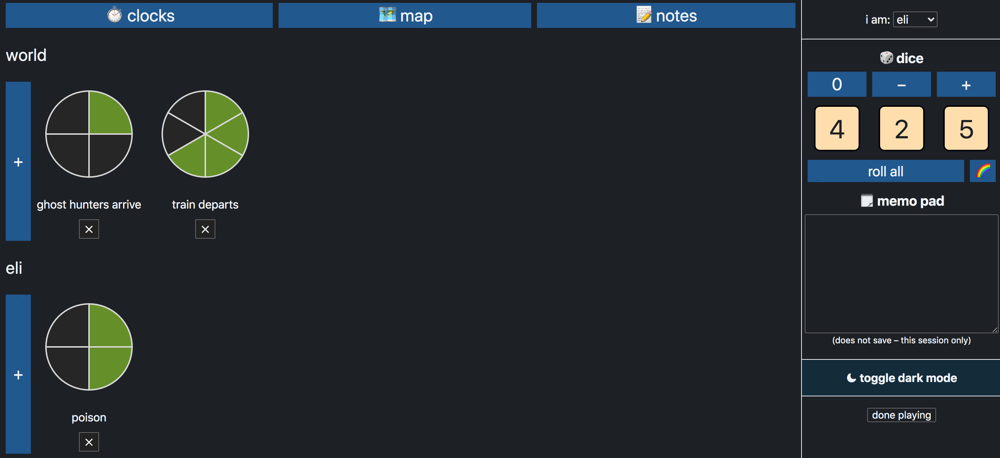
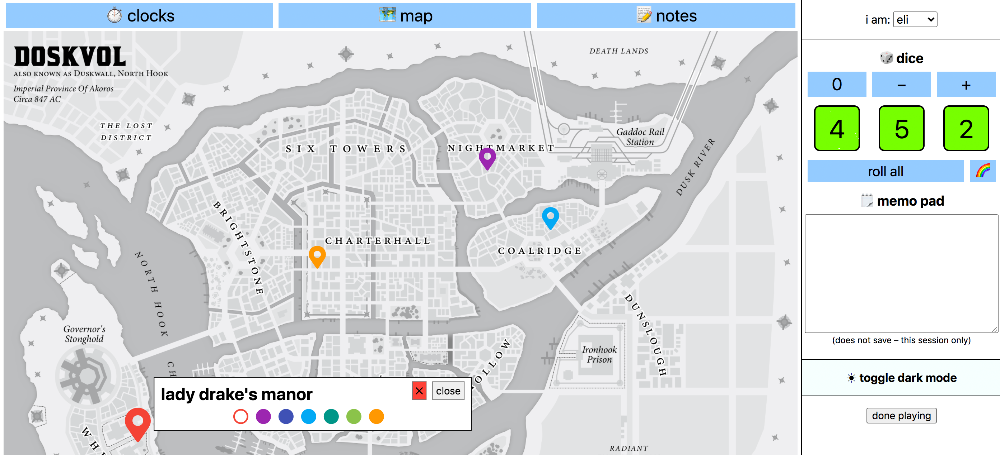
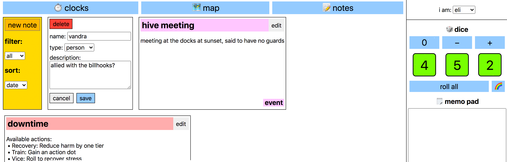

# blades-hud

An online dashboard/[HUD](https://en.wikipedia.org/wiki/Head-up_display) for John Harper's *[Blades in the Dark](https://en.wikipedia.org/wiki/Blades_in_the_Dark)* TTRPG.

## Development

```
$ npm install --legacy-peer-deps
$ npm start
```

Runs on [http://localhost:3000](http://localhost:3000) in the browser.

### Configuration
* `index.tsx`: Hardcoded [Firebase](https://firebase.google.com/) app info, campaign title, player names
* Set up Cloud Filestore (NoSQL backend) with the security rule found in `cloud_firestore_rules.txt` (gives access with auth only)
* Configure your `package.json` as described [here](https://create-react-app.dev/docs/deployment/#github-pages) to deploy to GitHub Pages

## Production

`npm run build` optimizes & builds the web app into the `build/` folder.

To deploy, run `npm run deploy`.

## Screenshots




